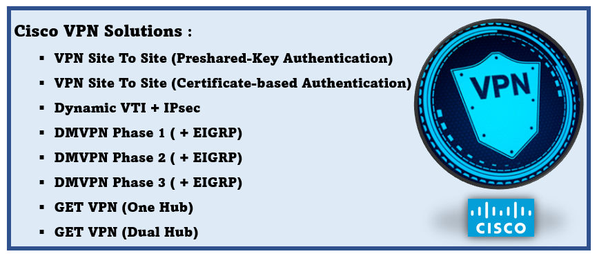

# Cisco-VPN-CheatSheet

This repo describes the configuration of various Cisco VPN solutions


## Quick navigation

- [VPN Site To Site Preshared Key Auth](README.md#VPN-Site-To-Site-Preshared-Key-Auth)
- [VPN Site To Site Certificate-Based](README.md#VPN-Site-To-Site-Certificate-Based)
- [DMVPN Phase 1](README.md#DMVPN-Phase-1)
- [DMVPN Phase 2](README.md#DMVPN-Phase-2)
- [DMVPN Phase 3](README.md#DMVPN-Phase-3)
- [Dynamic VTI ](README.md#Dynamic-VTI)
- [GetVPN Single Hub](README.md#GetVPN-Single-Hub)
- [GetVPN Dual Hub](README.md#GetVPN-Dual-Hub)


## VPN Site To Site Preshared Key Auth
### Phase 1 configuration
```
# crypto isakmp policy 1
   encr [encryption-Algorithm]
   hash [Hash-Algorithm]
   authentication pre-share
   group [Deffie-Hellman-Group]
   lifetime [Seconds]
# crypto isakmp key [Preshared-Key] address [Remote-PEER-IP]
```
### Phase 2 configuration

#### Define interesting trafic (trafic that should go through the VPN)

```
# ip access-list extended [ACCESS-LIST-NAME]
   permit ip [Local-Network] [Wildcard-Mask] [Remote-Network] [Wildcard-Mask]
```
#### Create a Transform-set
```
# crypto ipsec transform-set [Transform-Set-Name] [combination of individual IPSec transform-set]
```
#### Create a crypto-map
```
crypto map CMAP 10 [CRYPTO-MAP-NAME]
    set peer [REMOTE-PEER-IP]
    set transform-set [Transform-Set-Name]
    match address [ACCESS-LIST-NAME]
```
#### Apply the Created crypto Map to the interface used for the VPN

```
interface [INTERFACE-ID]
   crypto map [CRYPTO-MAP-NAME]
```

## VPN Site To Site Certificate-Based

### Prerequesite

- Time synchronisation NTP
- Active HTTP Server
#### CA Server 

- Define the domain name
 `ip domain-name domain.name`
- generate an exportable RSA Key
crypto key generate rsa modulus 1024 label `KEY_NAME` exportable

## DMVPN Phase 1
## DMVPN Phase 2
## DMVPN Phase 3
## Dynamic VTI
## GetVPN Single Hub
## GetVPN Dual Hub


